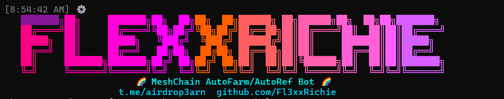
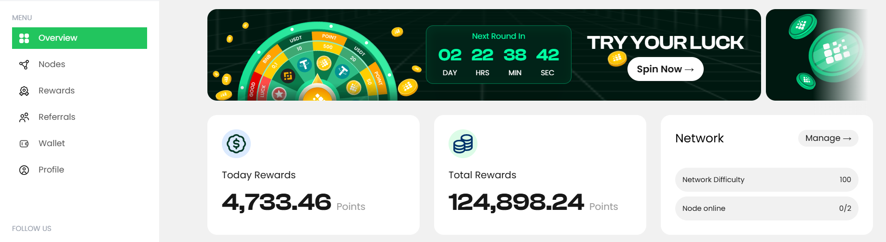
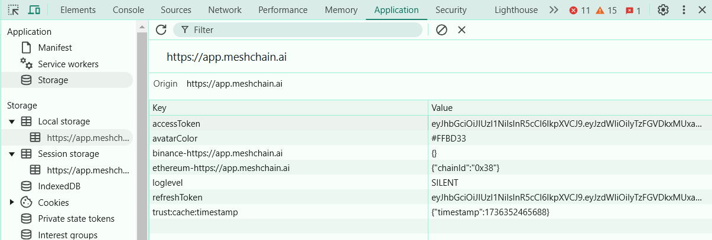

# MeshChain Network



MeshChain is a decentralized network that revolutionizes AI compute power accessibility. By providing affordable, scalable computing resources, MeshChain democratizes access to AI capabilities for developers, researchers, and enterprises.

🌐 [Launch App](https://app.meshchain.ai?ref=2O1FT911LZA6)



## Features

- 🔄 Multi-account Support
- 📝 Automated Registration
- ✉️ Email Verification
- 💧 BNB Faucet Claims
- 🔗 Node Initialization & Linking
- 💰 Automatic USDT Balance Check & Withdrawals
- 🎯 Auto-spin Functionality
- 🤖 Anti-captcha Integration

## System Requirements

- Node.js 16+
- Unique email for each account
- Internet connection
- (Optional) Proxy support

## Installation Guide

### Windows
```powershell
# Install Node.js from https://nodejs.org
git clone https://github.com/Fl3xxRichie/meshchain.git
cd meshchain
npm install
```

### macOS
```bash
# Install Homebrew
/bin/bash -c "$(curl -fsSL https://raw.githubusercontent.com/Homebrew/install/HEAD/install.sh)"
# Install Node.js
brew install node
git clone https://github.com/Fl3xxRichie/meshchain.git
cd meshchain
npm install
```

### Linux
```bash
# Ubuntu/Debian
curl -fsSL https://deb.nodesource.com/setup_16.x | sudo -E bash -
sudo apt-get install -y nodejs
# Clone and setup
git clone https://github.com/Fl3xxRichie/meshchain.git
cd meshchain
npm install
```

## Configuration Files

### token.txt



- Format: `access_token|refresh_token` (one account per line)
- Obtain from app.meshchain.ai (Network Inspector)

### unique_id.txt
- Contains node IDs (one per line)
- Extract from MeshChain extension

### proxy.txt (Optional)
- Add your proxies for enhanced security
- One proxy per line

## Commands

```bash
# Register new account
npm run register

# Start the bot
npm run start

# Auto-register with temp mail
npm run autoreg

# Check and withdraw USDT
npm run withdraw
```

## Recent Updates

- ✨ Automatic USDT balance checking and withdrawal
- 🔄 Token generation for accounts in `accounts.txt`
- 📝 New tokens saved to `newTokens.txt`
- 🔧 Proxy support implementation
- 🎮 Auto-spin feature
- 🤖 Anti-captcha integration [anti-captcha.com](https://anti-captcha.com/)

## Important Notes

- One account can only link to one nodeId
- Run `npm install` after each `git pull`
- Check logs for operation status
- Backup your configuration files regularly

## Support

For issues and updates, visit our GitHub repository or join our Telegram community.
- Private Channel: [Premium Script](https://t.me/+GIfY4Pb0Spw5OGZk)
- Public Channel: [Airdrop3arn](https://t.me/airdrop3arn)
- Direct Contact: [FlexxRichie](https://t.me/flexxrichie)
- Twitter: [@FlexxRichie](https://twitter.com/FlexxRichie)
- GitHub: [@Fl3xxRichie](https://github.com/Fl3xxRichie)

<div align="center">
  <i>Happy Farming! 🌱</i>
</div>